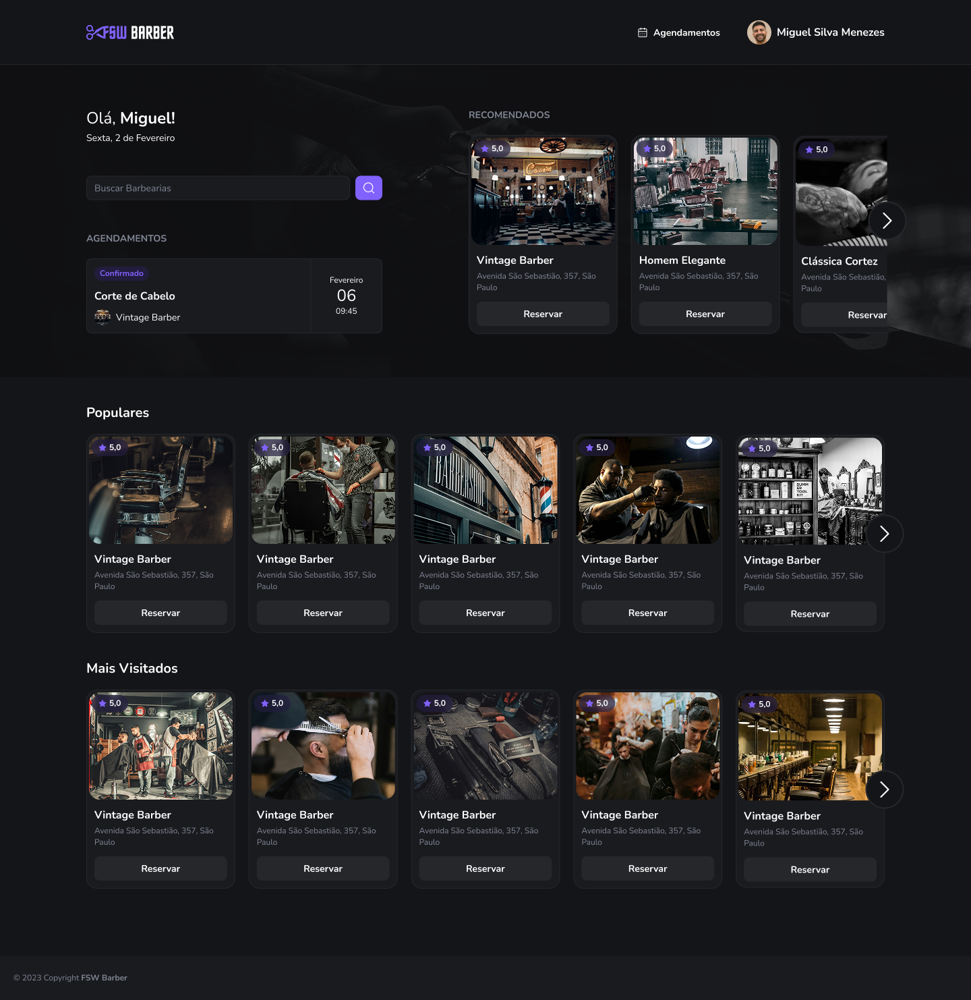

## 💥 barber

A aplicação permite gerir usuários, clientes, agendamentos e outras funcionalidades em uma barbearia.

## Índice

- ⚙ [Tecnologias utilizadas](#-tecnologias)
- 🚀 [Funcionalidades](#-funcionalidades)
- 💻 [Instruções para o front end e back-end](#-instruções-para-o-frontend-e-back)
- 🐞 [Criar testes](#-criar-testes) - Todo

---

## ⚙ Tecnologias

- **Front end**

  - [React](https://reactjs.org/)
  - [Nextjs14](https://nextjs.org/)
  - [Typescript](https://www.typescriptlang.org/)
  - [shadcnui](https://ui.shadcn.com/)
  - [tailwindcss](https://tailwindcss.com/)
  - [Date-fns](https://date-fns.org/)
  - [husky](https://www.npmjs.com/package/husky)

- **Outras tecnologias**
  - [Docker](https://www.docker.com/)

---

## 🚀 Funcionalidades

- Login Social

  - **Requisitos Funcionais**

    - O usuário deve poder logar com a sua conta do google;

  - **Requisitos Não-Funcionais**

    - O OAUTH usado para login deve ser o next-auth;

  - **Regras de Negócios**
    - Tem que ter uma conta do google para fazer login;

- Agendamento de serviços

  - **Requisitos Funcionais**

    - O usuário deve poder listar todas as barbearias cadastradas;
    - O usiario deve poder listar todos serviços de uma barbearia
    - O usiario deve poder listar uma barbearia
    - O usuário deve poder listar todos os horarios de um dia específico;
    - O usuário deve poder listar todos agendamentos que ele marcou ou que ja marcou;
    - O usuário deve poder realizar um novo agendamento com uma barbearia;

  - **Requisitos Não-Funcionais**

    - A listagem de prestadores deve ser armazenada em cache (Todo);

  - **Regras de Negócios**
    - Os agendamentos devem estar disponíveis entre 8h às 18h (primeiro às 8h e último às 17h);
    - O usuário não pode agendar em um horário já ocupado;
    - O usuário não pode agendar em um horário que já passou;

---

> Inicialmente precisamos clonar o repositório para ter acesso a todas as pastas

```bash
  # Clonando repositório
  git clone https://github.com/erildojs/barber.git
```

## 💻 Instruções para rodar a aplicação

Começaremos entrado na pasta da aplicação

```bash
  # Acessar a pasta do projeto
  cd barber

  # Baixar as dependências
  npm i

```

O projecto utiliza o docker, voce pode rodar o docker online usando o NEONDB ou local

```bash
  # Criando container com instância do postgres
  docker run --name database -e POSTGRES_PASSWORD=postgres -p 5432:5432 -d postgres

  # Inicializando as instâncias
  docker start database

```

Depois você precisará criar um .env na raiz da aplicação, onde terão todas variaveis de ambiente usada na aplicaçaõ (se vc não souber sobre variaveis de ambiente no nodejs, pesquise um pouco mais.)

Use _.env.example_ como modelo.

---

Agora precisas rodar as migrations do banco de dados.

```bash
  # Rodar migrations no prisma
  npx prisma migrate dev

```

Agora é so rodar a aplicacao

```bash
  # Rodar a aplicação
  npm run dev

```
